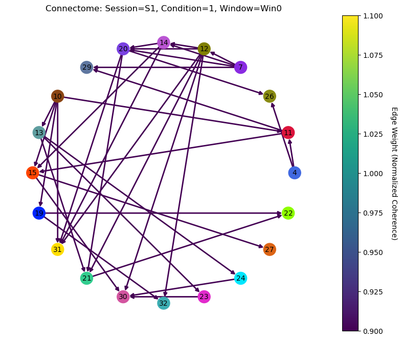
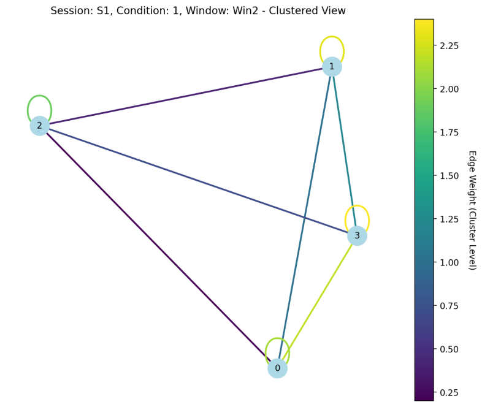

---

### **Autores**
Jaime B. Cirne*, Dardo N. Ferreiro++, Sergio A. Conde-Ocazionez***, João H.N. Patriota***, S. Neuenschwander** e Kerstin E. Schmidt*  
(*Universidade Federal do Rio Grande do Norte, Brasil; **Vislab, UFRN; ***Universidade de Amsterdã; ++Ludwig Maximilian Universität, Alemanha)

---

### **Abstract**

In the last two decades, neurophysiological data of both high temporal and spatial resolution from up to hundreds of simultaneously recorded intracortical channels have become increasingly available, thanks to technical advancements such as the higher packing density of microelectrodes, miniaturization of headstages and amplifiers, higher sampling frequencies, and improved signal-to-noise ratios of individual electrodes (e.g., Chen et al., 2022). However, classical analysis techniques often remain focused on serial, single-unit firing rate-based metrics (e.g., Conde-Ocazionez et al., 2017a) or paired measures such as coherence between channels, thereby largely ignoring the high dimensionality of mutual interactions in datasets from multiple parallel channels recorded under the same experimental conditions.
This issue has been partially addressed by computing spike statistics based on neuronal assemblies (e.g., Conde-Ocazionez et al., 2017b), where activity across multiple channels within the same time window is aggregated into population events, partially sacrificing spatial information about electrode distribution within recording matrices with spatial design.
A solution developed to build human brain connectivity maps from diffusion tensor or functional magnetic resonance imaging with datasets offering high spatial but poor temporal resolution, is graph-based analysis of the connectome derived from all functional or anatomical links between defined nodes such as cortical areas (for review, Sporns, 2015). This technique, however, has been sparsely applied to mesoconnectomic data obtained from extracellular recordings of spatially distributed cortical electrodes (e.g., Dann et al., 2016).
The correct interpretation of the results and accurate modeling of underlying circuits also heavily rely on effective data visualization. To address this, we developed a computational tool to model and interactively visualize brain mesoconnectomes derived from preprocessed electrophysiological data, such as interelectrode spike-spike or spike-field coherence measures (NES platform by SN and chronux toolbox by Bokil et al., 2010). The application utilizes graph theory and machine learning techniques to characterize neural connectivity and the identification of functional and structural differences between visual cortical connectomes of species with distinct evolutionary and behavioral traits.
We used metadata from two animal models: the domestic cat (Felis catus), a predator with periodic cortical maps similar to those of primates, and the agouti (Dasyprocta leporina), a diurnal herbivore and highly visual rodent with a cortex size comparable to the cat but featuring a rodent-typical salt-and-pepper map. Both species were studied under identical experimental conditions (Ferreiro et al., 2021).
The interface processes tabular neural connectivity data derived from multiple parallel electrophysiological recordings to model connectomes representing brain activity under different functional contexts. Distinct patterns were observed, confirming higher clustering of connections in the predator's visual cortex and a more dispersed connectivity pattern in the herbivore. The tool also facilitates navigation in big datasets because it enables interactive network visualization, exploratory analysis and deeper interpretation of the neurophysiological data.

---

### **Objetivo**
O objetivo principal desta aplicação é processar conectomas em formato de grafo, classificá-los com um modelo de rede neural gráfica (GNN) treinado e oferecer explicações das predições do modelo GNN utilizando técnicas de atribuição de importância (Integrated Gradients).

---

### **Metodologia**
- **Espécies Estudadas**: Gato (*Felis catus*) e Cutia (*Dasyprocta leporina*).
- **Técnicas Utilizadas**:
  - Análise de Grafos com **NetworkX**.
  - Modelagem baseada em **Graph Neural Networks (GNN)**.
  - Visualização interativa utilizando **Streamlit**.
  - Explicações interpretáveis das predições usando a biblioteca [Captum](https://captum.ai/)
  - Visualização de Embeddings Projeta as representações ocultas (features aprendidas) em um espaço 2D utilizando [t-SNE](https://scikit-learn.org/stable/modules/generated/sklearn.manifold.TSNE.html).
- **Base de Dados**: Registros eletrofisiológicos organizados em condições experimentais idênticas.

---

### **Resultados**
**Performance do Modelo GNN**:  


| Categoria  | Precisão | Recall | F1-Score | Suporte |
|------------|----------|--------|----------|---------|
| **Predador** | 0.95     | 0.95   | 0.95     | 60      |
| **Presa**   | 0.95     | 0.95   | 0.95     | 56      |
| **Acurácia** | -        | -      | 0.95     | 116     |

---

### **Características do Sistema**
- **Entrada**: Dados conectivos (e.g., Spike-Spike Coherence).
- **Saída**: Grafos interativos com clusters representativos.
- **Implementação**:
  - Pipeline desenvolvido em **Python**.
  - Classificação utilizando **PyTorch Geometric**.
  - Análise interpretável via **Captum**.
  
### **Contribuições**
1. **Visualização Avançada**: Conectomas interativos para navegação em grandes datasets.
2. **Detecção de Padrões**: Diferenças estruturais significativas em espécies estudadas.
3. **Ferramenta Educacional**: Potencial para treinamento em neurociência.

---

### **Imagens Adicionais**
**Visualização de Conectomas**:  


**Clusterização Louvain**:  


---

### **Referências**
1. Chen et al., (2022) *Nature Genetics*. DOI: [10.1038/s41597-022-01180-1](https://doi.org/10.1038/s41597-022-01180-1)
2. Ferreiro et al., (2021) *iScience*. DOI: [10.1016/j.isci.2020.101882](https://doi.org/10.1016/j.isci.2020.101882)
3. Bokil et al. (2010) *Journal of Neuroscience Methods*. DOI: [10.1016/j.jneumeth.2010.06.020](https://doi.org/10.1016/j.jneumeth.2010.06.020)

4. Conde-Ocazionez et al., (2018a),  DOI: [10.3389/fnsys.2018.00011](https://doi.org/10.3389/fnsys.2018.00011)
5. Conde-Ocazionez et al., (2018b),  DOI: [10.1111/ejn.13786](https://doi.org/10.1111/ejn.13786)

---

### **Contato**
[Instituto do Cérebro - UFRN](https://www.neuro.ufrn.br)  
[Biome - UFRN](https://bioinfo.imd.ufrn.br/)  

---

## **Características Principais**

1. **Upload de Arquivos**:
   - Suporte para arquivos `.csv` e `.pickle`.
   - Visualização dos dados carregados diretamente na interface.

2. **Geração de Conectomas**:
   - Processa os dados carregados e converte-os em grafos conectoma.
   - Gera representações gráficas dos conectomas.

3. **Classificação de Grafos**:
   - Utiliza um modelo GNN pré-treinado para classificar os grafos.
   - Exibe o rótulo predito e o grafo correspondente.

4. **Explicação das Predições**:
   - Explica as predições do modelo GNN utilizando técnicas de atribuição de importância (Integrated Gradients).
   - Apresenta gráficos interpretáveis para as contribuições das features.

5. **

---

## **Instalação**

### **1. Pré-requisitos**
Certifique-se de que você tem as seguintes ferramentas instaladas:
- [Python 3.8+](https://www.python.org/)
- [pip](https://pip.pypa.io/en/stable/)

### **2. Clone o Repositório**
```bash
git clone https://github.com/seu-usuario/conectoma-gnn-analyser.git
cd conectoma-gnn-analyser
```

### **3. Instale as Dependências**
Recomenda-se o uso de um ambiente virtual:
```bash
python -m venv env
source env/bin/activate  # Linux/macOS
env\Scripts\activate     # Windows

pip install -r requirements.txt
```

---

## **Como Usar**

1. **Inicie a Aplicação**
   ```bash
   streamlit run scripts/app.py
   ```

2. **Carregue os Dados**
   - Clique em **"Carregar arquivo de dados"** no menu lateral e selecione um arquivo `.csv` ou `.pickle`.

3. **Gere os Conectomas**
   - Clique no botão **"Gerar Conectoma"** para visualizar os grafos processados.

4. **Classifique os Grafos**
   - Clique em **"Classificar Grafos"** para prever os rótulos dos conectomas com o modelo GNN pré-treinado.

5. **Explique as Predições**
   - Clique em **"Explicar Predições"** para entender quais features influenciam as predições.

6. **Visualize com t-SNE**
   - Clique em **"Visualizar t-SNE"** para explorar as representações ocultas das features aprendidas pelo modelo.

---

## **Fluxo de Trabalho**

### **1. Processamento dos Dados**
Os dados carregados são transformados em conectomas utilizando a função `generate_connectome_from_data`. Cada conectoma é representado como um grafo contendo:
- **Nós**: Representando regiões cerebrais.
- **Arestas**: Representando conexões ponderadas entre regiões.

### **2. Geração de Conectomas**
Os conectomas são exibidos graficamente com informações adicionais, como pesos das arestas e clusters.

### **3. Classificação**
O modelo GNN analisa os grafos e prediz um rótulo correspondente à classe do conectoma.

### **4. Explicações**
Utilizamos o método **Integrated Gradients** da biblioteca Captum para calcular a importância das features dos nós na predição, tornando as decisões do modelo mais interpretáveis.

---

## **Explicação Técnica**
### **GNN Classifier**
A arquitetura do modelo inclui:
- **GCNConv**: Camadas convolucionais gráficas para capturar dependências locais.
- **Global Mean Pooling**: Reduz as representações dos nós para representar o grafo inteiro.
- **Fully Connected Layer**: Para gerar a predição final.

### **Captum**
Utilizamos o Captum para gerar explicações com:
- **Integrated Gradients**: Mede a contribuição de cada feature para a predição.

### **t-SNE**
Reduz as dimensões dos embeddings aprendidos para 2D, permitindo visualizar as relações entre os grafos.

---

## **Exemplo de Uso**

1. **Carregue um arquivo de dados:**
   - Um arquivo `.csv` contendo métricas de conectividade entre regiões cerebrais.

2. **Visualize os conectomas gerados:**
   - Grafos coloridos que mostram conexões ponderadas.

3. **Execute a classificação e visualize os rótulos:**
   - O modelo GNN prediz os estados ou condições cerebrais.

4. **Explore as explicações:**
   - Gráficos de barras que mostram a importância relativa de cada feature na predição.

5. **Visualize as relações dos conectomas:**
   - Use t-SNE para identificar padrões e clusters nos conectomas.

---

## **Contribuições**

1. **Adicione novos modelos**
   - Treine ou implemente novos modelos GNN com diferentes arquiteturas.

2. **Integre novos dados**
   - Adapte a função de geração de conectomas para diferentes formatos ou tipos de conectividade.

3. **Melhore as visualizações**
   - Personalize as representações gráficas para adicionar mais informações.

---

## **Licença**
Este projeto é distribuído sob a licença MIT.

---

Com esta explicação didática, a documentação do projeto está mais clara e organizada para uso e contribuição!
Este projeto implementa um pipeline completo para a análise de conectomas corticais a partir de dados eletrofisiológicos, incluindo:

- Geração de conectomas a partir de dados CSV.
- Implementação de uma Graph Neural Network (GNN) para classificação.
- Explicação das predições usando a biblioteca Captum.
- Visualização dos pesos dos neurônios com t-SNE.
- Interface interativa com Streamlit.

## **Estrutura do Projeto**

- **data/**: Dados de entrada em formato CSV.
- **outputs/**: Resultados gerados pelos scripts.
- **models/**: Modelos treinados.
- **scripts/**: Scripts Python para cada etapa do pipeline.
- **README.md**: Documentação do projeto.

## **Requisitos**

- Python 3.7 ou superior
- Bibliotecas listadas no `requirements.txt` (deve ser criado com base nas bibliotecas usadas)

## **Instruções de Uso**

1. **Clone o repositório e navegue até o diretório do projeto:**

   ```bash
   git clone https://github.com/jaimecirne/cortical_connectome_project.git
   cd cortical_connectome_project

   conda env create -f environment.yml

   pip install torch torchvision torchaudio --index-url https://download.pytorch.org/whl/cpu

   pip install torch-scatter torch-sparse torch-cluster torch-spline-conv torch-geometric -f https://data.pyg.org/whl/torch-2.0.1+gpu.html

   pip install captum

   set KMP_DUPLICATE_LIB_OK=TRUE
   ````

   Gere os conectomas:

   ```bash
   python scripts/generate_connectomes.py
   ````

   Treine a GNN:

   ```bash
   python scripts/train_gnn.py
   ```

   Explique as predições:

   ```bash
   python scripts/explain_predictions.py
   ```
   Visualize os pesos com t-SNE:

   ```bash
   python scripts/visualize_tsne.py
   ```
   Execute a interface Streamlit:

   ```bash
   streamlit run scripts/app.py
   ```
   

### Pontos:
1. **Formato das Variáveis:**
   - `x shape`: representa os atributos dos nós no grafo, com dimensões `(número de nós, características por nó)`. Exemplo: `[1024, 32]` indica 1024 nós com 32 atributos cada.
   - `edge_index shape`: define as conexões (arestas) no grafo com formato `[2, número de arestas]`. Cada coluna do tensor `edge_index` representa uma aresta entre dois nós.

2. **Edge Index Tensor:**
   - Este tensor conecta os nós no grafo e define como os dados fluem entre os nós na arquitetura da rede.

3. **Métricas de Treinamento:**
   - **Loss (Perda):** Representa o erro durante o treinamento. Neste caso, a perda permanece em torno de `2.485-2.486`, o que pode indicar dificuldades no aprendizado ou a necessidade de ajustes no modelo.
   - **Acurácia:** As taxas de acurácia de treino (≈8.49%) e teste (≈7.69%) são baixas, sugerindo que o modelo pode estar subajustado ou que os dados possuem um alto grau de complexidade para a arquitetura atual.

4. **Alterações nas Conexões:**
   - As mudanças em `edge_index` entre as épocas podem estar relacionadas a diferentes amostras ou estratégias como dropout estrutural nos grafos, variando a topologia para melhorar a generalização.

5. **Dimensão Reduzida:**
   - Em algumas etapas, a dimensão de `x` e `edge_index` é menor (e.g., `[96, 32]` e `[2, 1488]`). Pode ser uma subamostra ou uma parte específica do grafo processada de forma independente.

### Possíveis Melhorias:
- **Ajuste de Hiperparâmetros:**
  - Revisar a taxa de aprendizado e regularização.
  - Testar arquiteturas diferentes, como aumento de camadas ou dimensões no espaço latente.

- **Pré-processamento de Dados:**
  - Normalização ou balanceamento de dados.
  - Ajuste na definição de conexões para refletir melhor as relações entre os nós.

- **Análise do Modelo:**
  - Verificar se o modelo está aprendendo corretamente (análise de gradientes, checagem de overfitting/underfitting).
  - Avaliar a adequação do modelo à tarefa em termos de arquitetura e loss function.

Se precisar de uma análise mais detalhada ou ajuda para interpretar os resultados, por favor, forneça mais contexto sobre o modelo e o problema abordado.